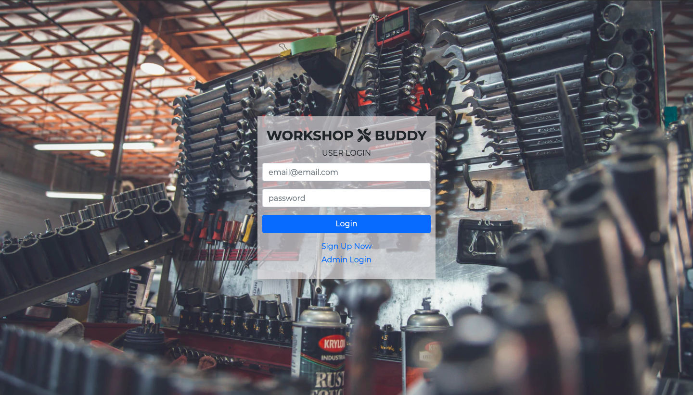
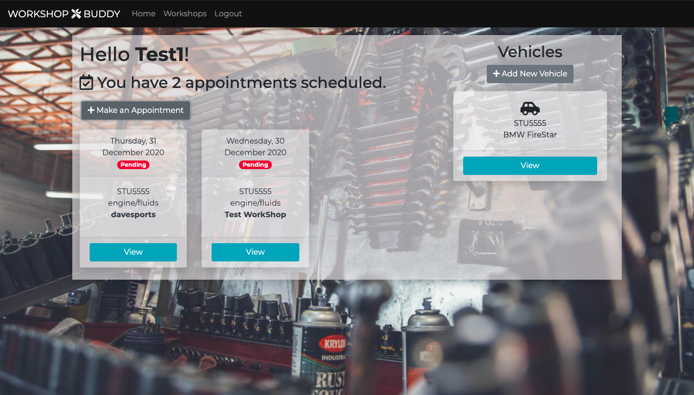
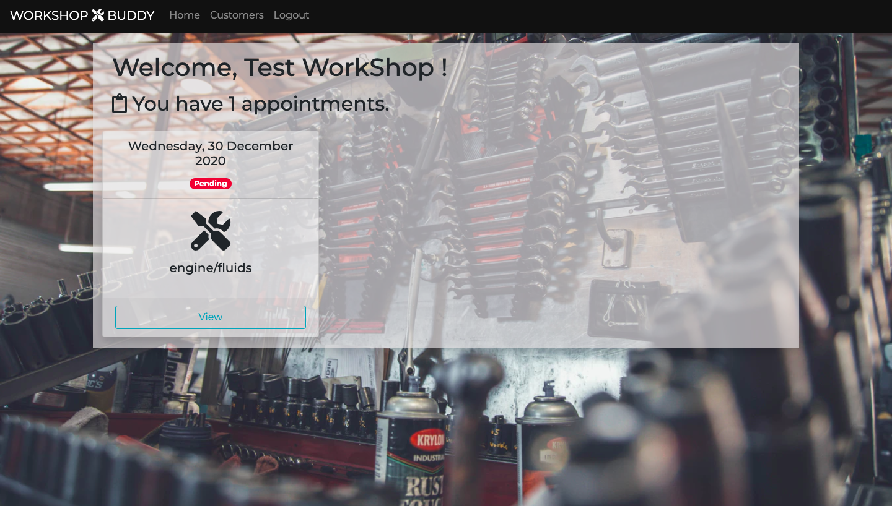
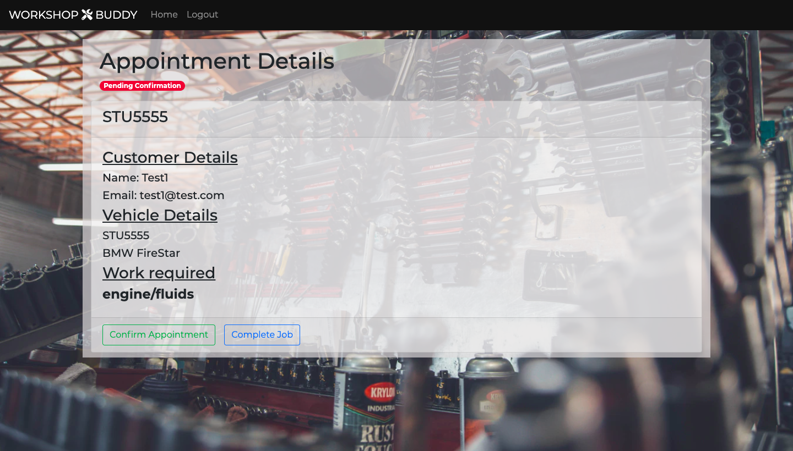
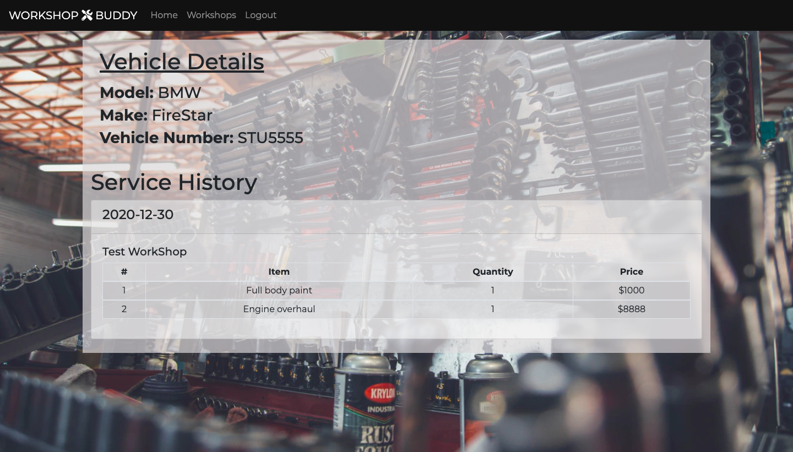

# Project 3 - WorkShop buddy

## Link & Description

Link: https://workshopbuddy.herokuapp.com/

This is a project aiming to be a platform for vehicles repair and maintenance for customers and workshops. The aim of this app is to enable convenient appointment makings, track appointments and store service records/history for the customer and workshops to view.

## Team Break-Down

Wong Kin Ken
Khairul Syazwan
Dave Li

## TechStack

- React
- React Bootstrap
- MongoDB
- axios
- express

### Login Page

### Customer Dashboard

### Workshop Dashboard

### Appointment Page

### Confirmed Appointment

### Service Record for Vehicle

### Unsolved problems

No error message when login or registration error.
Validation of the date and multiple entries on the same date is not in place.

## Acknowledgments

Thanks to the help and co-operation from Khairul and Dave, we are able to complete this project together successfully. It was a good learning experience to be able to build a FullStack app with MERN stack.
